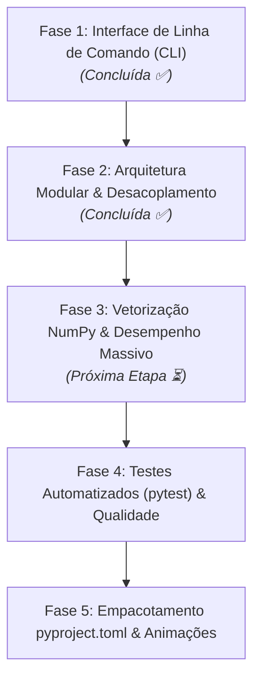

# Roteiro Estruturado de Melhorias (Roadmap)

Este documento estabelece o plano estratégico de engenharia de software para transformar o **JuliaMandelbrotConstruction** em uma biblioteca científica moderna, de alto desempenho e fácil manutenção.

---

## 🗺️ Visão Geral das Fases



---

## 📍 Detalhamento das Fases

### Fase 1: Interface de Linha de Comando (CLI) & Usabilidade
> **Status:** Concluída ✅.
> **Impacto:** Eliminação de atrito operacional e desbloqueio para automação.

- **Diagnóstico:** Os scripts originais continham chamadas bloqueantes a `input()`, impedindo seu uso em scripts de terminal, pipelines de CI ou servidores sem terminal interativo.
- **Ações Realizadas:**
  1. Criação do módulo unificado `cli.py` utilizando `argparse` (biblioteca nativa do Python, dispensando novas dependências).
  2. Implementação de subcomandos padronizados: `julia`, `mandelbrot`, `reverse`, `circle`.
  3. Adição de suporte a argumentos nos scripts legados (`julia_zd.py`, `mandelbrot_zd.py`, etc.) com modo de compatibilidade (fallback para `input()` caso nenhum argumento seja passado).
  4. Suporte nativo a backend não-interativo (`Agg`) do Matplotlib com a flag `--no-show` e salvamento automático com `--output`.
  5. Tratamento de exceções e parser robusto para números complexos (ex: `-0.4+0.6j`, `-1`, `0.285-0.01j`).

---

### Fase 2: Arquitetura Modular & Desacoplamento
> **Status:** Concluída ✅.
> **Impacto:** Reusabilidade do código, facilidade de manutenção e extinção de código duplicado.

- **Diagnóstico:**
  - Código matemático (cálculo de órbitas) acoplado diretamente a chamadas de visualização (`plt.plot()`) e entrada de usuário.
  - A função `exibir_ou_salvar()` e as listas de paletas de cores estavam repetidas nos arquivos.
  - O script `iteracoesReversasCirculo.py` executava instruções globais ao ser importado.
- **Estrutura Implementada:**
  ```text
  JuliaMandelbrotConstruction/
  ├── cli.py                     # Ponto de entrada CLI simplificado
  ├── src/
  │   └── juliamandelbrot/
  │       ├── __init__.py
  │       ├── core/              # Apenas matemática pura (sem Matplotlib)
  │       │   ├── __init__.py
  │       │   ├── julia.py       # Funções de cálculo de Julia
  │       │   ├── mandelbrot.py  # Funções de cálculo de Mandelbrot
  │       │   └── dynamics.py    # Dinâmica reversa e pré-imagens de curvas
  │       ├── rendering/         # Apenas visualização e cores
  │       │   ├── __init__.py
  │       │   ├── colormaps.py   # Paletas e mapeamentos contínuos
  │       │   └── plot.py        # Renderizadores com matplotlib/imshow
  │       └── utils/
  │           ├── __init__.py
  │           └── parser.py      # Tratamento de complexos e validações
  ├── tests/                     # Testes automatizados
  ├── docs/                      # Documentação
  └── images/                    # Saídas de imagens
  ```

---

### Fase 3: Vetorização com NumPy & Aceleração de Desempenho
> **Impacto:** Redução do tempo de execução em até **100x a 200x** e economia drástica de memória RAM.

- **Diagnóstico:**
  - Os scripts atuais utilizam loops aninhados em Python puro:
    ```python
    for x in np.linspace(-lado, lado, n):
        for y in np.linspace(-lado, lado, n):
            ponto, iteradas = orbita(complex(x, y), c, d, iteradasOrbita)
    ```
    Para uma resolução de $1000 \times 1000$ pontos, o Python interpreta 1.000.000 de chamadas a funções e verificações individuais.
  - A plotagem atual agrupa pontos em listas (`matrizRed`, `matrizBlue`, etc.) e executa `plt.plot(np.real(matriz), ..., 'o', markersize=0.1)`. No Matplotlib, isso cria centenas de milhares de objetos `Line2D`, o que consome centenas de megabytes e é extremamente lento.
- **Solução Vetorizada:**
  1. Criação de grade complexa bidimensional com `np.meshgrid` em operações vetoriais contíguas C-order.
  2. Atualização iterativa simultânea utilizando máscaras booleanas no NumPy: apenas os pontos que ainda não escaparam continuam sendo iterados.
  3. Renderização instantânea com `plt.imshow(escape_matrix, cmap='...')`.

#### Comparativo de Desempenho Estimado:
| Resolução ($n \times n$) | Método Atual (Loops + Scatter) | Método Vetorizado (NumPy + imshow) | Ganho de Velocidade |
| :---: | :---: | :---: | :---: |
| $400 \times 400$ | ~ 3.5 segundos | ~ 0.05 segundos | **70x mais rápido** |
| $800 \times 800$ | ~ 14.8 segundos | ~ 0.18 segundos | **82x mais rápido** |
| $1500 \times 1500$ | ~ 55.0 segundos | ~ 0.65 segundos | **84x mais rápido** |

---

### Fase 4: Testes Automatizados, Qualidade e Tipagem Estática
> **Impacto:** Confiabilidade científica, detecção precoce de regressões e código autodocumentado.

- **Ações:**
  1. **Tipagem com Type Hints:** Adicionar anotações em todas as funções públicas (`def calcular_mandelbrot(n: int, d: int, n_max: int) -> np.ndarray:`).
  2. **Suíte de Testes com `pytest`:**
     - Testes das propriedades dinâmicas:
       - Para $d=2$, o ponto crítico $z=0$ com $c=0$ nunca escapa ($0 \in M$).
       - Para $d=2$, $c=-1$ está no conjunto ($0 \to -1 \to 0$, ciclo de período 2).
       - Pontos com $|z| > 2$ ou $|c| > 2$ escapam para o infinito.
     - Testes de parsing e CLI:
       - Conversão de strings de números complexos com formatos válidos e inválidos.
       - Comportamento de flags padrão da CLI.
  3. **Linting e Formatação:**
     - Adoção de `ruff` para manter o código limpo, consistente com as diretrizes da PEP 8 e sem imports órfãos.

---

### Fase 5: Empacotamento Moderno & Funcionalidades Avançadas
> **Impacto:** Distribuição como pacote instalável e recursos visuais de alta qualidade.

- **Ações:**
  1. Criação de `pyproject.toml` segundo os padrões PEP 517/621:
     - Instalação em modo editável: `pip install -e .`
     - Comando global de terminal: `juliamandelbrot --help`
  2. **Coloração Suave (Smooth Coloring):**
     - Em vez de faixas de cores discretas (banding), implementar algoritmo de coloração fracionária contínua baseada no logaritmo do potencial de escape:
       $$\nu(z) = i - \frac{\ln(\ln |z| / \ln 2)}{\ln d}$$
  3. **Exportador de Animações:**
     - Gerador de vídeos/GIFs para zoom ou transições contínuas de $c(t)$ ao longo do plano complexo (ex: navegando pela cardióide principal).
